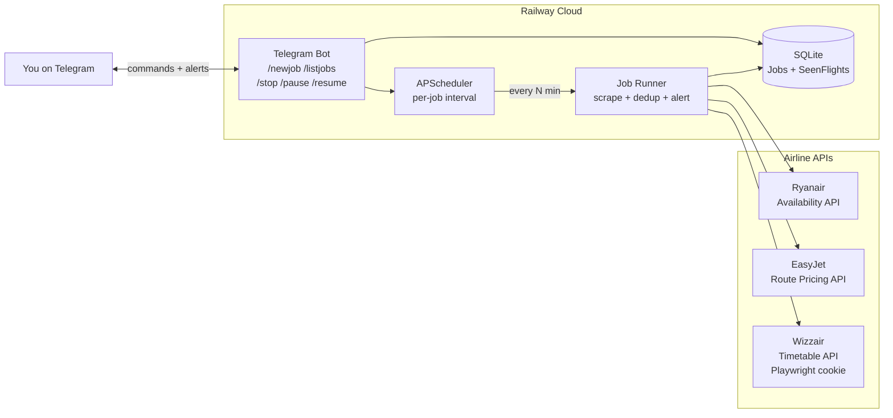
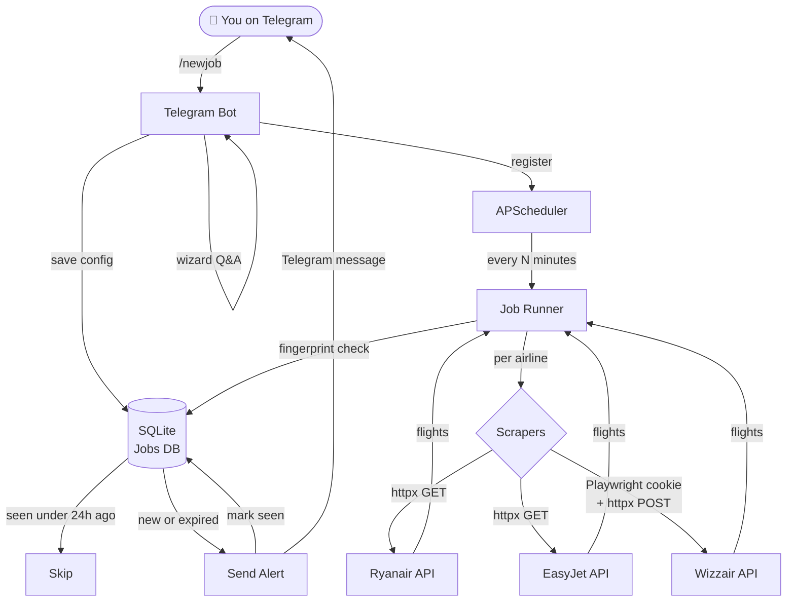
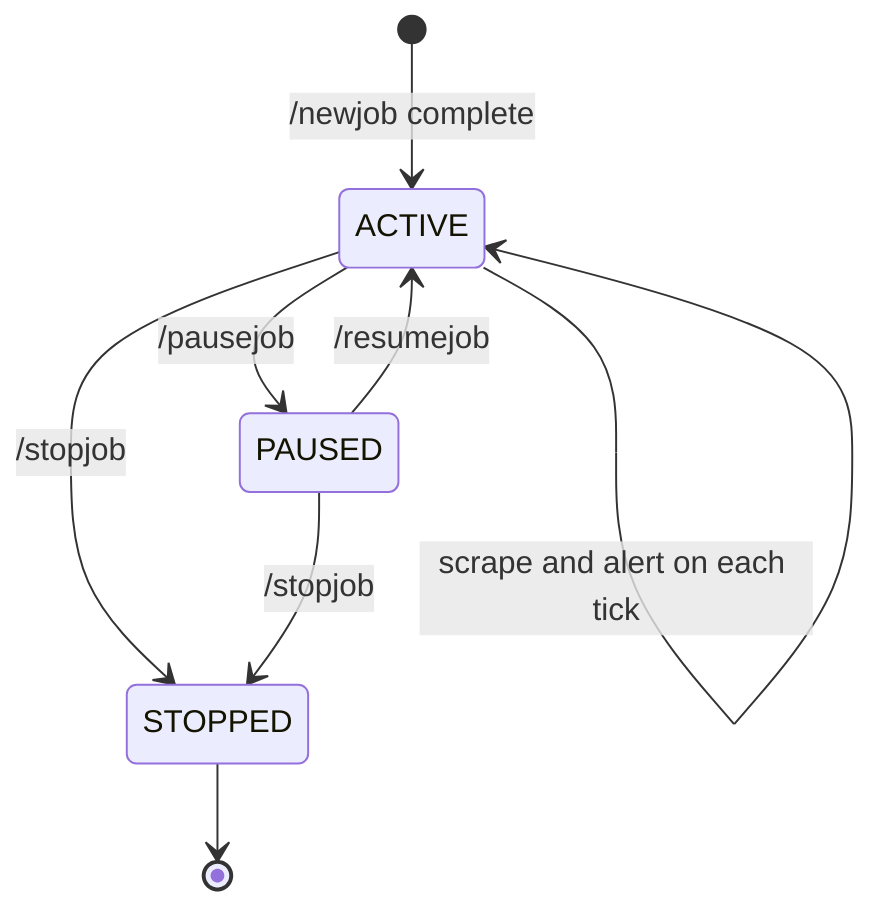
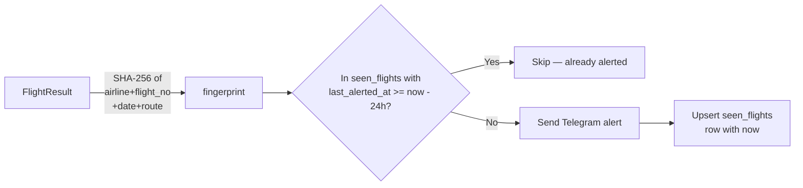
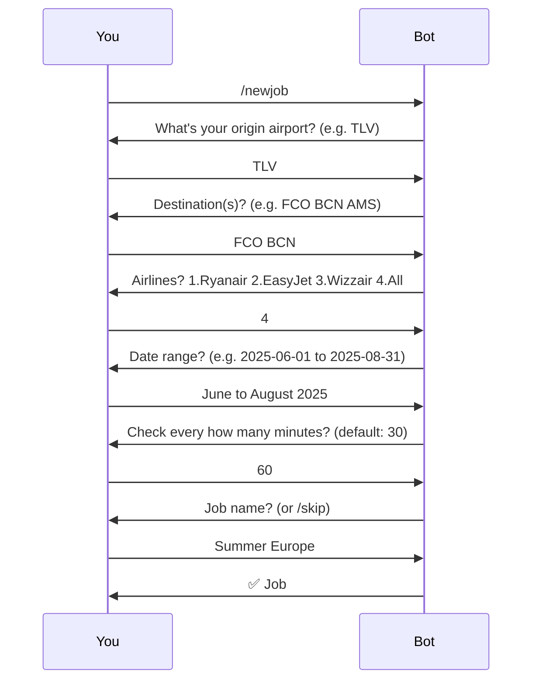

# ✈️ Flights Scanner

A Telegram-managed flight monitoring system that scrapes **Ryanair**, **EasyJet**, and **Wizzair** on a configurable schedule, detects available flights to your chosen destinations, and sends instant Telegram alerts with direct booking links.

Designed for **2 adults with 10 kg bags**. Runs 24/7 on Railway (free tier) — no Mac needed.

---

## Features

- **Multi-job support** — run multiple independent search jobs simultaneously, each with its own origin, destinations, airlines, dates, and check interval
- **Telegram-native UX** — create, pause, stop, and monitor jobs entirely from your phone
- **Smart deduplication** — same flight won't alert again within 24 hours
- **Direct booking links** — every alert includes a pre-filled link to the airline's booking page
- **Resilient scraping** — one airline failing doesn't affect the others
- **Always-on** — deployed to Railway cloud, runs continuously

---

## System Architecture



---

## Data Flow



---

## Job Lifecycle



---

## Deduplication Logic



---

## Telegram Commands

| Command | Description |
|---|---|
| `/newjob` | Start a guided wizard to create a new search job |
| `/listjobs` | Show all jobs with status and last run time |
| `/pausejob <id>` | Pause a job (keeps config, stops checking) |
| `/resumejob <id>` | Resume a paused job |
| `/stopjob <id>` | Permanently stop a job |
| `/status` | Show system health — active/paused job counts, UTC time |
| `/cancel` | Cancel an in-progress /newjob wizard |

### /newjob wizard



---

## Notification Format

When a new flight is found, you receive:

```
🚀 New flight found! [Summer Europe #3]
TLV → FCO | Ryanair FR1234
📅 Jun 14, 2025
💰 €89.99/person — 2 adults, 10kg bags
[Book now →](https://www.ryanair.com/...)
```

---

## Project Structure

```
flights-scanner/
├── main.py              # FastAPI app — webhook, lifespan, handler registration
├── models.py            # Pydantic models: JobConfig, FlightResult
├── database.py          # SQLModel tables: Job, SeenFlight, JobStatus
├── notifier.py          # Telegram message formatting and sending
├── job_runner.py        # Core loop: scrape → dedup → alert
├── scheduler.py         # APScheduler: per-job interval scheduling
├── scrapers/
│   ├── base.py          # Abstract BaseScraper interface
│   ├── ryanair.py       # Ryanair internal availability API (httpx)
│   ├── easyjet.py       # EasyJet route pricing API (httpx)
│   ├── wizzair.py       # Wizzair timetable API (Playwright cookie + httpx)
│   └── registry.py      # get_scraper("ryanair") → RyanairScraper()
├── bot/
│   ├── wizard.py        # /newjob ConversationHandler + parsing helpers
│   └── handlers.py      # /listjobs /stopjob /pausejob /resumejob /status
├── tests/               # 33 tests (pytest + pytest-asyncio)
├── requirements.txt
├── railway.toml         # Railway deployment config
└── .env.example         # Environment variable template
```

---

## Tech Stack

| Layer | Technology |
|---|---|
| Language | Python 3.12 |
| Web framework | FastAPI + uvicorn |
| Telegram bot | python-telegram-bot v21 (async, webhook mode) |
| Scraping | Playwright (Chromium) + httpx |
| Scheduler | APScheduler (AsyncIOScheduler) |
| Database | SQLite via SQLModel |
| Deployment | Railway (free tier, always-on) |
| Testing | pytest + pytest-asyncio (33 tests) |

---

## Setup & Deployment

### 1. Get Telegram credentials

1. Message **@BotFather** on Telegram → `/newbot` → copy the token
2. Message **@userinfobot** → copy your chat ID

### 2. Deploy to Railway

```bash
brew install railway
railway login
railway init
railway variables set TELEGRAM_BOT_TOKEN=your_token_here
railway variables set TELEGRAM_CHAT_ID=your_chat_id_here
railway variables set DATABASE_URL=sqlite:///./flights.db
railway up
```

After deploy, Railway gives you a public URL (e.g. `https://flights-scanner-production.up.railway.app`):

```bash
railway variables set WEBHOOK_URL=https://flights-scanner-production.up.railway.app
railway up
```

### 3. Add persistent storage (Railway dashboard)

Service → **+ Add Volume** → mount at `/app`

This ensures `flights.db` survives redeploys.

### 4. Verify

```bash
curl https://your-app.railway.app/health
# → {"status":"ok"}
```

Then open Telegram and send `/status` to your bot.

---

## Local Development

```bash
git clone https://github.com/fabiomantel/flights-scanner
cd flights-scanner
python -m venv .venv && source .venv/bin/activate
pip install -r requirements.txt
playwright install chromium

cp .env.example .env
# fill in TELEGRAM_BOT_TOKEN and TELEGRAM_CHAT_ID

uvicorn main:app --reload --port 8000
```

Run tests:

```bash
pytest tests/ -v
```

---

## Adding a New Airline

1. Create `scrapers/myairline.py` extending `BaseScraper` with `airline_name = "myairline"` and implement `search()`
2. Register it in `scrapers/registry.py`
3. Add tests in `tests/test_myairline_scraper.py`

That's it — the wizard, job runner, and scheduler pick it up automatically.

---

## License

MIT
